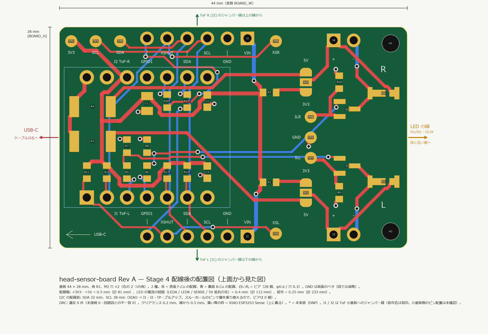
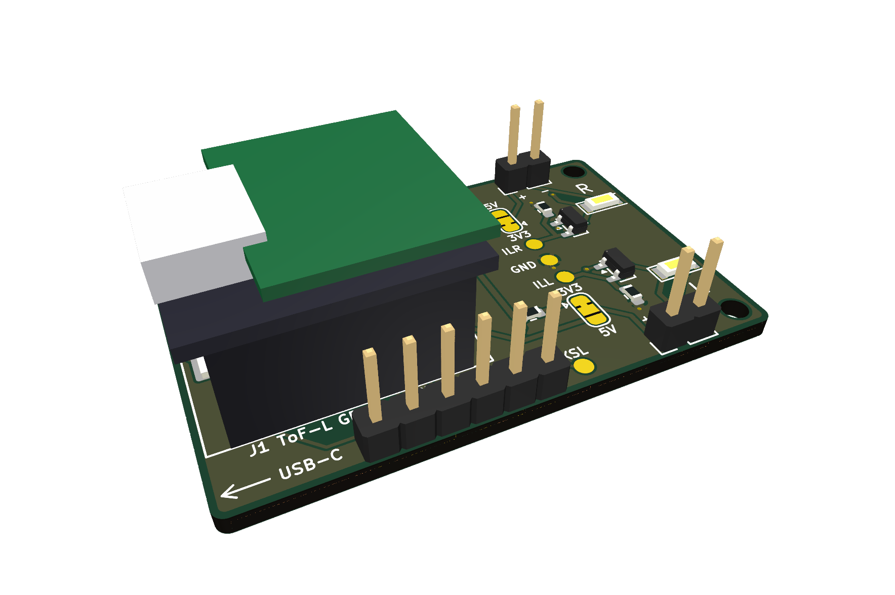
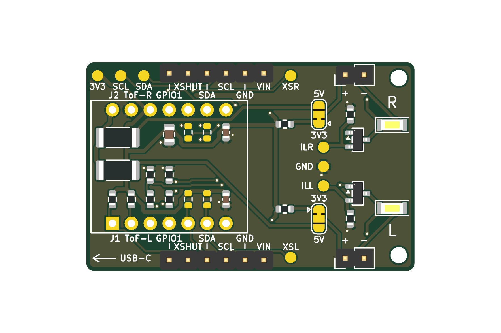

# head-sensor-board

**蛇ロボット（Serpens）Floor Watch の「頭のセンサー基板（試作用）」**の KiCad プロジェクト。

- 用途: ToF の崖判定（HG-H2 の T6-1〜T6-4）と、斜め LED の追試（T4）。**本番の基板ではない。**
- 載せるもの: XIAO ESP32S3 Sense（ソケット）、VL53L1X 小基板 ×2（**1×6 ヘッダからジャンパー線で引き出す**）、白色チップ LED NSSW157T ×2（MOSFET + PWM。外付け LED 用ヘッダつき）、I2C プルアップ（未実装可）、テストポイント
- 電源は既定で XIAO の **3V3 だけ**。LED の電源だけ、半田ジャンパーで **5V** に切り替えられる。電流の計算は [docs/spec.md](docs/spec.md) §4
- KiCad 10.0.1（回路図 `20260306` / 基板 `20260206`）
- バージョン管理: GitHub（**プライベート** `hattoir/head-sensor-board`）+ [BoardRepo](https://boardrepo.com)

> ## ⚠ ToF 小基板のピン配置は**未確認**（ヘッダの並びは仮）
> VL53L1X 小基板（Amazon B083Z316NC）のピン配置・基板上のプルアップ・I2C アドレスは、販売ページに記載がなく、現物も手元にない。
> J1/J2 の並び（1 VIN, 2 GND, 3 SCL, 4 SDA, 5 XSHUT, 6 GPIO1）は**仮**（PLACEHOLDER）。**ジャンパー線でつなぐので、並びが違っても基板の作り直しは要らない**（線でつなぎ替える）。そのため、ピン配置が未確認でも基板のガーバー自体は出せる（User 指示 2026-10-01）。
> **現物が届いたら、下の「ToF 小基板のピン配置と、ジャンパー線の対応表」を埋める。**

> ## ⚠ 電源の運用上の注意（User 指示 2026-10-01。回路図の注記 H にも同じ内容）
> 1. **5V は試験用の選択肢で、既定は 3V3。** 5V にしたときの合計 **493 mA は USB 2.0 の 500 mA ぎりぎり**（余裕 7 mA）。XIAO の 5V ピンの電流能力は未確認。
> 2. **3V3 は、Wi-Fi 送信・撮影・LED 100 %・ToF ピークを同時にしない運用が必要。** **実機で XIAO の 5V 入力電流を測るまで。**（Seeed の条件不明の 0.65 A を上限と見ると 3V3 の合計は 808 mA = Seeed の「700 mA」の 115 %。[docs/spec.md](docs/spec.md) §4.3）

## 進み具合

| Stage | 内容 | 状態 |
|---|---|---|
| 1 | 仕様と部品表 | 完了（2026-10-01、承認済み） |
| 2 | 回路図と ERC（エラー 0） | 完了（2026-10-01、User 確認済み。ERC 0 件） |
| 3 | 外形と部品配置案（配線なし） | 完了（2026-10-01、User 確認済み） |
| 4 | 外形 44×28 mm、配線、DRC（違反 0・未接続 0・回路図との不一致 0）、3D ビュー、製造データ | **完了（2026-10-02）。製造データ（ガーバー・ドリル・位置ファイル・BOM、ZIP）は [gerbers/](gerbers/) に出した。User の最終確認待ちで、発注はしていない**（[docs/spec.md](docs/spec.md) §6・§7） |

## 配線後の配置（Stage 4）



- **44 × 28 mm、角 R1、M2 穴 ×2**（右の 2 つの角、縁から 2.1 mm）。2 層。`python tools/make_board.py --width W --height H` で、外形・配置・配線・DRC まで作り直せる（[再生成と検証](#再生成と検証)）。
- **USB-C は左の縁**（左下に矢印と「USB-C」の刻印）、**LED（D1/D2）と外付け LED ヘッダ（J3/J4）は右寄りの縁**、**ToF ヘッダ（J1/J2）は上下の長辺の縁**（6 本の信号名を刻印）、TP は上面。**「L」「R」の刻印**あり。
- **下半分 = L チャンネル、上半分 = R チャンネル**（上面から見て USB-C を左にしたとき）。基板上の L/R はロボットの左右とは限らない（ジャンパー線で左右は自由に決められる）。
- 配線: **電源（+3V3・+5V）0.5 mm、LED の電流の経路 0.4 mm、信号 0.25 mm**。GND は両面のベタ。ビア 28 個。I2C の長さは SDA 32 mm・SCL 38 mm。
- **DRC: 違反 0 件**（クリアランス 0.2 mm・縁 0.5 mm・未接続 0・回路図との不一致 0。プロジェクトで「無視」にしていた 4 種の検査も有効にして 0 件）。[docs/drc_report.txt](docs/drc_report.txt)
- **刻印の検査**（`tools/check_board.py`）: 上面の刻印 137 個が、ランド・ほかの刻印と **0.15 mm 以上**、ヘッダの樹脂部（2.54 mm 角）と 0.05 mm 以上、XIAO の外形・基板の縁と離れている。**シルクの線は全部 0.15 mm 以上、文字の高さは 0.8 mm**（2026-10-05 に 0.12 → 0.15 mm に直した。発注先 4 社の公開仕様との照合 → [docs/fab_check.md](docs/fab_check.md)。**JLCPCB の標準の文字（高さ 1.0 mm 以上）だけは未達で、注文画面の「高精度の文字」を選べば通る**。PCBWay・Elecrow・Seeed Fusion は通る）。J1/J2 の信号名は樹脂部の外に 2 段で置き、奥の段には樹脂部の手前までの引き出し線を引いた。
- XIAO の下（ソケットの内側）に小さい部品を置き、裏面は GND ベタ。Sense 拡張ボード（カメラ・microSD）は XIAO の上面に載り、基板側の部品とは干渉しない（出っ張りは未確認。[docs/spec.md](docs/spec.md) §6.5）。

| | |
|---|---|
|  |  |
| 斜め上から（XIAO・拡張ボードは**簡易な箱**。高さは仮） | 真上から（XIAO を外した状態） |

そのほか: [層ごとの配線](docs/routing_layers.png)（表面 F.Cu・裏面 B.Cu）、[3D 真上](docs/board_3d_top.png)、[3D 裏面](docs/board_3d_bottom.png)。

## ToF 小基板のピン配置と、ジャンパー線の対応表（**現物が届いたら埋める**）

J1 / J2 の 6 本は、ToF 小基板（VL53L1X、Amazon B083Z316NC）へジャンパー線でつなぐ。**小基板のピン配置は販売ページに記載がなく、未確認。** ヘッダの並び（上面に信号名を刻印）は仮で、**小基板の並びが違っても基板の作り直しは要らない**（線でつなぎ替える）。J1 = ToF L（下の縁）、J2 = ToF R（上の縁）。pin1 は右端（上面から見て、VIN）。

### J1 / J2 の向き（Stage 3 から 180° 回した理由）と確認結果

- **ピン 1（四角いパッド）は右端**（上面から見て USB-C を左にしたとき）。刻印の並びは**右から** VIN, GND, SCL, SDA, XSHUT, GPIO1（左から読むと GPIO1, XSHUT, SDA, SCL, GND, VIN）。J1 と J2 は同じ向き・同じ x（ピン 1 = 基板の左端から 23.8 mm）。
- Stage 3 ではピン 1 が左端だった。**Stage 4 で 180° 回した理由**: XIAO では SDA（D4）が SCL（D5）の左にある。ヘッダも SDA が SCL の左になる向きにすると、I2C の線が交差せずに、層の乗り換え（ビア）も減る。ヘッダの**信号の割り当て（pin1 = VIN … pin6 = GPIO1）は回路図のまま変えていない**（並べ替えは物理的な向きだけ）。ジャンパー線で小基板につなぐので、向きは線の取り回しにしか影響しない。
- 確認（`python tools/check_board.py`、基板を直接読む）: J1/J2 の 6 パッドすべてで、**基板のネット = 回路図のネット = 刻印の名前**（pin1 +3V3/VIN、pin2 GND、pin3 SCL、pin4 SDA、pin5 XSHUT_L/R、pin6 TOF_L_INT/TOF_R_INT/GPIO1）。四角いパッドは pin1 だけ。

### 小基板の仕様（現物で確認して埋める）

| 項目 | 値 | 確認 |
|---|---|---|
| 基板上の印字（ピンの名前、端から順に） | （現物で確認） | 🔴 未確認 |
| ピンの数・ピッチ・オス/メス | （現物で確認） | 🔴 未確認 |
| 電源電圧 | 3.3〜5 V（商品ページの記載） | 🟡 |
| 基板上のプルアップ（SDA / SCL / XSHUT）、レギュレータ、レベルシフタの有無 | （現物で確認） | 🔴 未確認 |
| I2C アドレス | ST のデータシートの既定は 0x29（7 bit）。**小基板で変わるかは未確認** | 🟡 |

### 対応表（J1 / J2 のピン ↔ 小基板のピン）

| J1 / J2 のピン | 基板の信号名 | つなぎ先 | 小基板のピン（印字）→ **現物で記入** | ジャンパー線 | メモ |
|---|---|---|---|---|---|
| 1 | VIN | XIAO の 3V3 | （　　　　） | （　　　　） | 小基板が 3.3〜5 V 対応なので 3V3 を使う。**VIN と GND を逆につながない**（小基板の保護は未確認） |
| 2 | GND | GND | （　　　　） | （　　　　） | |
| 3 | SCL | I2C SCL（D5） | （　　　　） | （　　　　） | プルアップは基板側 R14（3.3 kΩ、既定は未実装）か小基板側 |
| 4 | SDA | I2C SDA（D4） | （　　　　） | （　　　　） | 同 R13（既定は未実装） |
| 5 | XSHUT | J1: XSHUT_L（D0）／J2: XSHUT_R（D1） | （　　　　） | （　　　　） | 10 kΩ で 3V3 にプルアップ済み |
| 6 | GPIO1 | J1: R15 経由で D8／J2: R16 経由で D9 | （　　　　） | （　　　　） | R15/R16（0 Ω）は**既定で未実装**（つながない）。割り込みを使うときだけ実装 |

**2 個の小基板は I2C アドレスが同じ**なので、XSHUT で 1 個ずつ起動して、片方のアドレスを変える（[docs/spec.md](docs/spec.md) §3）。

## フォルダ構成

| 場所 | 中身 |
|---|---|
| （直下） | KiCad プロジェクト（`.kicad_pro` / `.kicad_sch` / `.kicad_pcb`、`sym-lib-table` / `fp-lib-table`） |
| `.ai/` | 閉ループの記録（`CURRENT_HANDOFF.md`、`PROJECT_STATE.json`、`TASK_GRAPH.json`、`DECISIONS.jsonl`、`EXPERIMENTS.jsonl`、`EVIDENCE.jsonl`。追記専用の `.jsonl`）。次のセッションはここから再開する |
| `docs/` | [spec.md](docs/spec.md)（仕様・計算・配置・配線・検証）、[fab_check.md](docs/fab_check.md)（発注先の公開仕様との照合）、[bringup_plan.md](docs/bringup_plan.md)（届いてからの確認手順 = Human Gate）・[bringup_nets.md](docs/bringup_nets.md)（導通の確認表）、[bom.md](docs/bom.md)・`bom.csv`（部品表。**Stage 2 のまま**。BOM の出力時に再生成）、`erc_report*.txt`・`drc_report.txt`、回路図 PDF、配線後の配置図・層ごとの配線・3D ビュー（PNG）、`routes.json`（配線の結果）、`led_budget_output.txt` |
| `libs/` | 自作のシンボル・フットプリント（**KiCad 標準ライブラリに無いものだけ**。下の「ライブラリの出典」） |
| `3dmodels/` | 3D ビュー用の**簡易モデル**（`.wrl`。XIAO + Sense 拡張ボード、LED の箱）。`tools/gen_3d.py` で生成。見た目の確認用 |
| `gerbers/` | **製造データ**（ガーバー、ドリル、位置ファイル、BOM、`head-sensor-board_gerbers.zip`、README）。2026-10-02 に出した。**発注はしていない**（User の最終確認のあと）。中身の説明は [gerbers/README.md](gerbers/README.md) |
| `tools/` | 計算・生成・検証のスクリプト（下の「再生成と検証」） |

## 数値・部品名の出典

確認状態: ✅ 原本（データシート・公式図面）で確認 ／ 🟡 販売ページ・Wiki で確認 ／ 🔴 未確認・仮定。**確認できていないものは、`docs/spec.md` の各表に「未確認」と書いてある。**

| 対象 | 出典 | 確認 |
|---|---|---|
| NSSW157T（Nichia）: 外形 3.0×1.4×0.52、VF、IF max、推奨ランド | [Nichia STS-DA1-1913（秋月配布 PDF）](https://akizukidenshi.com/goodsaffix/nssw157t.pdf)、[秋月 116884](https://akizukidenshi.com/catalog/g/g116884/) | ✅ |
| AO3400A（Alpha & Omega）: VGS(th)、RDS(on) @2.5 V、SOT-23 | [AOS データシート Rev 3.1](https://www.aosmd.com/res/data_sheets/AO3400A.pdf) | ✅ |
| Si2302CDS（Vishay）: VGS(th)、RDS(on) @2.5 V、1=G 2=S 3=D | [Vishay 68645（S12-2336 Rev D）](https://www.vishay.com/docs/68645/si2302cds.pdf) | ✅ |
| VL53L1X（ST）: AVDD 2.6〜3.5 V、消費電流、XSHUT・I2C・既定アドレス、最短 4 cm | ST DS12385 Rev 8（[複製 PDF](https://www.makerguides.com/wp-content/uploads/2024/10/VL53L1X-Datasheet.pdf)。ST 公式サイトの版では未照合） | ✅（複製） |
| ESP32-S3: Wi-Fi 送信ピーク 340 mA、GPIO の IOH/IOL、VOH、GPIO3 ストラッピング | [Espressif ESP32-S3 Datasheet v2.2](https://www.espressif.com/sites/default/files/documentation/esp32-s3_datasheet_en.pdf)（表 5-7・表 5-4・§3.4） | ✅ |
| XIAO ESP32S3: ピン配置、GPIO 番号、3V3 出力 700 mA、Webcam の消費電流、Sense が使う GPIO | [Seeed wiki](https://wiki.seeedstudio.com/xiao_esp32s3_getting_started/)（PDF のデータシートは見つからず） | 🟡 |
| XIAO の穴パターン（ピッチ 2.54、行間隔 15.25、穴 φ1.02、外形 21×17.8） | [Seeed "XIAO Series Package and PCB Design" p.7](https://www.seeedstudio.com/blog/wp-content/uploads/2022/08/Seeed-Studio-XIAO-Series-Package-and-PCB-Design.pdf)（シリーズ共通図。S3 個別ではない） | ✅（共通図） |
| VL53L1X 小基板（Amazon B083Z316NC）: 12×17×3.2 mm、3.3〜5 V | [商品ページ](https://www.amazon.co.jp/dp/B083Z316NC)。**ピン配置・プルアップ・アドレスの記載なし** | 🔴 |
| 頭の外形 幅 100 / 高さ 74 / 長さ 78 mm、ToF・LED の位置 | `serpens/ai-shared/design-state.md`、`serpens/docs/design/tof_board_placement_2026-09-30.md`（Design の概念値 = CAD_CONCEPT / ASSUMED） | 🔴（概念値） |
| T6 / T4 の試験の内容 | `serpens/ai-shared/HARDWARE_TODO.md` HT-005 / HT-011、HG-H2 の `hardware_test_plan.md`・`tof_cliff.md`（Engineering の worktree `agent/engineering-h1-j1`、未マージ） | 🟡 |

## ライブラリの出典

`libs/` にあるのは、KiCad 標準ライブラリに無い（または標準を少し変えた）7 点だけ（`python tools/gen_libs.py` で生成）。

| 名前 | 種類 | 理由 | 出典 |
|---|---|---|---|
| `XIAO_ESP32S3` | シンボル（14 ピン。電源ピンを上下に置いた表示。ピン番号は実物のまま） | 標準ライブラリに XIAO ESP32S3 が無い | ピン配置は Seeed wiki |
| `ToF_Header_1x06` | シンボル（ピン名つき。**並びは仮 = 未確認**） | ピン名（VIN, GND, SCL, SDA, XSHUT, GPIO1）を回路図に出すため | 自作 |
| `Q_NMOS_GSD` | シンボル（SOT-23 の 1=G 2=S 3=D） | 標準の `Device:Q_NMOS` はピン番号が D/G/S の文字で、SOT-23 のパッド番号と合わない | 図形は KiCad 標準 `Device:Q_NMOS` を流用、ピン番号だけ数字に |
| `XIAO_ESP32S3_THT_2x7_P2.54mm` | フットプリント（穴パターン） | 標準には表面実装用の `RF_Module:MCU_Seeed_ESP32C3` しか無く、2.54 mm の穴パターンが無い | Seeed 公式図面 p.7（行間隔 15.24 mm = 図面の 15.25 を 0.6 in に丸めた、穴 φ1.02、パッド φ1.8）。**コートヤードはピン列の帯だけ**（XIAO の下に小さい部品を置くため。Stage 3） |
| `TestPoint_Pad_D1.5mm_NoSilk` | フットプリント（TP） | 標準の `TestPoint:TestPoint_Pad_D1.5mm` の銀色の輪（半径 0.95 mm）が、近くに置く名前の刻印と重なるため | KiCad 標準 `TestPoint_Pad_D1.5mm` から輪だけ除いた（パッド φ1.5、コートヤード 半径 1.05）。Stage 3 |
| `PinHeader_1x06_P2.54mm_NoSilk` | フットプリント（J1/J2。ToF ヘッダ） | 標準の `Connector_PinHeader_2.54mm:PinHeader_1x06_P2.54mm_Vertical` の上面シルクの外枠が、6 本の信号名の刻印と重なるため | KiCad 標準から**上面シルクの外枠（線・四角）だけ除いた**（ランド・穴・コートヤード・Fab・3D は標準のまま）。Stage 4 |
| `LED_Nichia_NSSW157T` | フットプリント（T 字のランド） | 標準ライブラリに同寸法のものが無い | Nichia STS-DA1-1913 p.4–5（全長 4.0、カソード 0.6+1.66、ギャップ 0.5、アノード 0.64+0.6、高さ 1.55/0.86） |

3D モデル: 標準ライブラリにある部品（ピンヘッダ、抵抗、MOSFET など）は標準のモデル。**XIAO + Sense 拡張ボードと NSSW157T は `3dmodels/` の簡易な箱**（高さは仮。見た目の確認用で、寸法の根拠にしない）。

## 再生成と検証

```bash
python tools/led_budget.py        # LED 電流・3V3/5V の総電流の計算（docs/led_budget_output.txt）
python tools/gen_libs.py          # 自作ライブラリ（libs/）と sym-lib-table / fp-lib-table
python tools/gen_3d.py            # 簡易 3D モデル（3dmodels/）
python tools/gen_schematic.py     # 回路図（※KiCad で手直しした後は実行しない。手直しが消える）
python tools/check_netlist.py     # ネットリストを期待と照合、回路図のピン番号がフットプリントのパッドに存在するか
python tools/make_board.py [--width 44 --height 28] [--reuse-routes]
                                  # 外形・配置（gen_pcb.py）→ 自動配線（route.py、numpy + scipy）→ トラック・ビア・GND ベタ（apply_routes.py）→ DRC。
                                  # ※既存の基板を作り直す（KiCad で手で直した配線は消える）。約 30 秒
                                  # --reuse-routes: ランドの位置を変えず刻印だけ直したとき、配線をやり直さない（DRC で整合を確かめる）。自動配線は約 1〜10 分（CPU が空いていれば 1 分以内）
"C:/Program Files/KiCad/10.0/bin/python.exe" tools/check_board.py   # J1/J2 のネット・パッド・刻印の照合、刻印のすきまの検査（問題があれば終了コード 1）
"C:/Program Files/KiCad/10.0/bin/python.exe" tools/render_routed.py   # 配線後の配置図・層ごとの配線（docs/*.png）
python tools/render_3d.py         # KiCad の 3D ビュー（docs/board_3d_*.png）
python tools/make_outputs.py [--bom]   # ERC・DRC・回路図 PDF・BoardRepo 用 zip（--bom で BOM も）
python tools/make_fabrication.py  # gerbers/（ガーバー・ドリル・位置ファイル・BOM・ZIP）。**User の確認のあとにだけ**
python tools/verify_gerbers.py    # 出力した ZIP を別のライブラリ（gerbonara）で読み直して、基板と照合（pip install gerbonara）
python tools/compare_gerbers.py --current   # gerbers/ が今の基板から作り直した図形と同じか（古くなっていないか）。2 つの ZIP / git の ref の比較にも使える
"C:/Program Files/KiCad/10.0/bin/python.exe" tools/check_fab_rules.py [--md docs/fab_check.md]   # 発注先 4 社の公開仕様（tools/fab_rules.json）との照合
python tools/gen_bringup_tables.py   # 導通の確認表 docs/bringup_nets.md（回路図から）
python tools/run_all_checks.py    # 上の検査を全部まとめて回す（何も書き換えない。発注の前に）
```
KiCad は `C:/Program Files/KiCad/10.0/bin/kicad-cli.exe`（PATH には入っていない）。`tools/pcb_template.kicad_pcb` は空の基板（層・設定だけ。`gen_pcb.py` が毎回ここから作る）。
自動配線は KiCad の Python に scipy が無いため、基板の形状を `docs/placement_geometry.json` に書き出し → システムの Python で配線 → `docs/routes.json` → KiCad の Python で基板に書き戻す、の 3 段。

## BoardRepo について

- BoardRepo は「アップロードのたびに番号つきの版ができる」方式で、閲覧・MCP は OAuth のサインインが要る（[boardrepo.com](https://boardrepo.com)）。**Agent 側からは取り込みを確認できない。User が手動でアップロードする。**
- `snake-main-board` の GitHub リポジトリにも、BoardRepo の Webhook・チェック・コミットステータスは残っていない（確認済み）。
- **アップロード用の束**: `C:\2026\Serpens_Home AI\head-sensor-board_upload.zip`（`tools/make_outputs.py` が作る。Git には入れない）。中身: `.gitignore`、`README.md`、`.kicad_pro`、`.kicad_sch`、`.kicad_pcb`（**Stage 4: 44×28 mm、配線済み・GND ベタ。ガーバーではない**）、`sym-lib-table`、`fp-lib-table`、`libs/`（自作ライブラリ）、`3dmodels/`（簡易 3D モデル）。別フォルダに展開して、ERC 0 件・DRC 0 件になることを確認する（make_outputs 後に実施）。
- **アップロードして表示できたかは User の確認が要る。**

## 注意

- `*-backups/`、`fp-info-cache`、`*.kicad_prl`、ロックファイル、自動保存、`*_upload.zip` は Git に入れない（`.gitignore`）。
- このフォルダは、親の `serpens`（ロボット制御のリポジトリ）とは**別の Git リポジトリ**（入れ子）。親側は `.git/info/exclude` で無視している。`snake-main-board` とも別。
